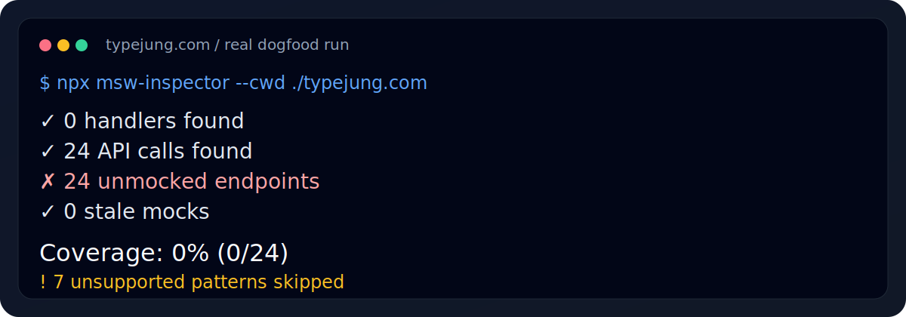

# msw-inspector


Find gaps in your API mock coverage before they reach CI.

MSW handlers drift. API calls get added without mocks, and old mocks stay behind after the code moves on. `msw-inspector` scans both sides, compares them, and reports what is covered, what is not, and what looks stale.

## Install

```bash
npm install -D msw-inspector-cli
```

The npm package is published as `msw-inspector-cli` because the original `msw-inspector` name is already taken on the registry. The installed binary remains `msw-inspector`.

## CLI

Run it from the project root:

```bash
npx msw-inspector
```

Or run it without installing first:

```bash
npx msw-inspector-cli
```

Useful flags:

```bash
npx msw-inspector \
  --handlers "src/**/*.{ts,tsx,js,jsx,mts,mjs,cjs}" \
  --sources "src/**/*.{ts,tsx,js,jsx,mts,mjs,cjs}" \
  --exclude "**/dist/**" "**/*.d.ts" \
  --base-url "https://api.example.com" \
  --report-file msw-inspector.json \
  --format text
```

The CLI prints a human-readable summary by default. Use `--format json` when you want the full report for CI or a downstream action.

If your app uses relative URLs but you want origin-aware matching, set `--base-url`. That resolves relative handlers and API calls against one canonical origin, which is useful when the same pathname exists on multiple backends.

## Output

Text output looks like this:

```bash
✓ 23 handlers found
✓ 31 API calls found
✗ 8 unmocked endpoints
✗ 3 stale mocks

Coverage: 74% (23/31)
```

Here is a real run against `typejung.com`:



The JSON report written by `--report-file` includes:

```json
{
  "schemaVersion": 1,
  "summary": {
    "mockedCalls": 23,
    "totalCalls": 31,
    "usedHandlers": 20,
    "totalHandlers": 23,
    "staleHandlers": 3,
    "unmockedCalls": 8,
    "percentage": 74.2
  }
}
```

## Example Report

Dogfood run on `typejung.com`:

```json
{
  "summary": {
    "mockedCalls": 0,
    "totalCalls": 24,
    "usedHandlers": 0,
    "totalHandlers": 0,
    "staleHandlers": 0,
    "unmockedCalls": 24,
    "percentage": 0
  },
  "unsupported": 7,
  "sampleUnmocked": [
    "POST https://oauth2.googleapis.com/token",
    "GET https://www.googleapis.com/oauth2/v2/userinfo",
    "POST /api/chat",
    "POST /api/create-checkout-session"
  ]
}
```

That run surfaced a complete mock gap across auth, billing, and AI endpoints instead of a single missing handler.

## Dogfooding

I ran the analyzer against three real repositories:

- `typejung.com`: `0` handlers, `24` API calls, `24` unmocked endpoints, `7` unsupported dynamic patterns.
- `msw`: narrowed to the browser test slice, `191` handlers, `2` API calls, `190` stale mocks, `28` unsupported patterns.
- `oss-msw`: same slice, `191` handlers, `2` API calls, `189` stale mocks, `28` unsupported patterns.

The strongest product signal came from `typejung.com`: it immediately showed that a real app could have a non-trivial API surface with zero MSW coverage. The two MSW repos exercised the other side of the problem, where handlers accumulate and drift stale when the active request surface gets narrower.

## Supported patterns

The first release is intentionally narrow:

- `msw` `http.*` handlers
- legacy `msw` `rest.*` handlers
- handler matchers from string literals, static template literals, static `const`s, `new URL(...).href`, `new URL(...).toString()`, and `String(new URL(...))`
- `fetch(...)`, `window.fetch(...)`, `globalThis.fetch(...)`
- common `axios` call shapes, including `axios.get(...)`, `axios.request(...)`, `axios(...)`, and same-file `axios.create(...)` instances

## GitHub Action

The repo ships with a thin GitHub Action wrapper. It reads the JSON report that the CLI already produced, writes a job summary, and can optionally upsert one sticky PR comment.

```yaml
name: msw coverage

on:
  pull_request:
  push:

jobs:
  inspect:
    runs-on: ubuntu-latest
    steps:
      - uses: actions/checkout@v4
      - uses: actions/setup-node@v4
        with:
          node-version: 20
          cache: npm
      - run: npm ci
      - run: npx msw-inspector --report-file msw-inspector.json --format json
      - uses: felmonon/msw-inspector@v1
        with:
          summary-file: msw-inspector.json
          comment: true
```

The action does not compute a baseline delta yet. It publishes the current report cleanly and predictably.

GitHub Marketplace publication is a separate packaging step. GitHub's current requirement is a dedicated action repository without workflow files, so this repository keeps the CLI and CI together and ships the action directly from GitHub.

## Limitations

- It does not try to infer custom wrapper helpers.
- It does not resolve cross-file constants or imported axios instances.
- It does not analyze GraphQL, WebSocket, or SSE handlers.
- It reports dynamic or ambiguous patterns as unsupported instead of guessing.

## Local Development

```bash
npm install
npm test
npm run typecheck
npm run build
```

If you are changing the scanning logic, keep the test fixtures small and explicit. The tool is more useful when it stays opinionated.
